# RetailSec AI 🛡️


**RetailSec AI** is a next-generation **Security Operations Center (SOC)** dashboard designed specifically for the retail sector. It leverages specialized AI agents to detect, analyze, and remediate cyber threats—ranging from credential stuffing to Point-of-Sale (POS) malware—in real-time.

---

## 🚀 Overview

The retail industry faces a unique and escalating threat landscape. Traditional SIEMs are often too generic, missing retail-specific context like POS anomalies or loyalty program fraud. 

**RetailSec AI** bridges this gap by combining rule-based heuristics with Generative AI (Llama-3 via Groq) to provide **context-aware threat intelligence**. It empowers security analysts to:
1.  **Ingest** raw server logs.
2.  **Detect** sophisticated attack patterns.
3.  **Understand** the "why" behind an alert using AI.
4.  **Respond** with simulated containment actions.

---

## ⚡ Key Features

- **Autonomous Multi-Agent Core**: Visualizes the pipeline from log ingestion to reporting.
- **Real-Time Threat Detection**: Instant identification of malicious patterns.
- **AI-Powered Analysis**: Integrated **Groq (Llama-3)** client explains alerts in plain English and recommends mitigation steps.
- **Interactive Dashboard**: 
  - dynamic charts (Recharts) for threat distribution.
  - Live KPI metrics (Critical Threats, Actions Taken).
  - Advanced filtering and search.
- **Attack Simulator**: Built-in tool to inject malicious logs (Credential Stuffing, Payment Fraud) to validate detection rules.
- **Simulated Response**: "Block IP" capability with visual feedback and persistence.
- **Incident Reporting**: One-click generation of text-based executive summaries.

---

## 🛡️ Threats Detected

| Threat Type | Detection Logic | Severity |
|:---|:---|:---|
| **Credential Stuffing** | >10 failed logins from same IP within 2 mins | Critical |
| **Payment Fraud** | High-value transaction after multiple failures | Critical |
| **Bot Traffic** | >100 API requests/min with suspicious User-Agent | High |
| **POS Malware** | After-hours activity or repeated terminal failures | High |

---

## 🏗️ Architecture

RetailSec AI operates on a 5-agent pipeline architecture:

```mermaid
graph LR
    A[📂 Log Ingestion] -->|Normailzed Logs| B[🔍 Threat Classification]
    B -->|Known Signatures| C[📊 Anomaly Detection]
    C -->|Zero-Day Outliers| D[🧠 Response Agent]
    D -->|Mitigation Plan| E[📝 Reporting Agent]
    
    style A fill:#dbeafe,stroke:#2563eb,stroke-width:2px
    style B fill:#e0e7ff,stroke:#4f46e5,stroke-width:2px
    style C fill:#f3e8ff,stroke:#9333ea,stroke-width:2px
    style D fill:#fef3c7,stroke:#d97706,stroke-width:2px
    style E fill:#d1fae5,stroke:#059669,stroke-width:2px
```



---

## 🛠️ Tech Stack

- **Framework**: [Next.js 14](https://nextjs.org/) (React, TypeScript)
- **Styling**: [Tailwind CSS](https://tailwindcss.com/) + `clsx`
- **Visualization**: [Recharts](https://recharts.org/)
- **Icons**: [Lucide React](https://lucide.dev/)
- **AI Engine**: [Groq SDK](https://groq.com/) (Llama-3-70b)
- **State Management**: React Hooks + LocalStorage

---

## 📸 Screenshots

| Dashboard | Analyze Page |
|:---:|:---:|
|  |  |
*Placeholders for actual application screenshots.*

---

## 🚦 Getting Started

### Prerequisites
- Node.js 18+
- npm or yarn
- Grid API Key (Optional, for AI features)

### Installation

1.  **Clone the repository**:
    ```bash
    git clone https://github.com/your-org/retailsec-ai.git
    cd retailsec-ai
    ```

2.  **Install dependencies**:
    ```bash
    npm install
    ```

3.  **Configure Environment**:
    Create a `.env.local` file in the root directory:
    ```env
    NEXT_PUBLIC_GROQ_API_KEY=gsk_your_groq_api_key_here
    ```
    > *Note: If no API key is provided, the app uses a fallback mock AI response.*

4.  **Run Locally**:
    ```bash
    npm run dev
    ```
    Open [http://localhost:3000](http://localhost:3000) in your browser.

---

## 🧪 How to Demo

1.  Navigate to the **Analyze** page.
2.  Click **"Load Sample Data"** to populate the engine with legitimate traffic.
3.  Click the red **"Simulate Attack"** button. This injects 20 malicious logs.
4.  Observe the analysis results (look for "Credential Stuffing" alerts).
5.  Select an alert to view the **AI Explanation**.
6.  Click **"Save Results"** and go to the **Dashboard**.
7.  On the Dashboard, click **"View"** on a Critical alert and select **"Simulate Block IP"**.

---

## 🔮 Future Scope

- **Backend Integration**: Connect to real SIEMs (Splunk, Elastic) via API.
- **User Authentication**: Role-based access control (RBAC) for Analysts vs Admins.
- **Real Response**: Integration with firewall APIs (Palo Alto, Cisco) for actual blocking.
- **Dark Web Monitoring**: Add an agent to scan for leaked credentials.

---

© 2026 RetailSec AI Project. All rights reserved.
